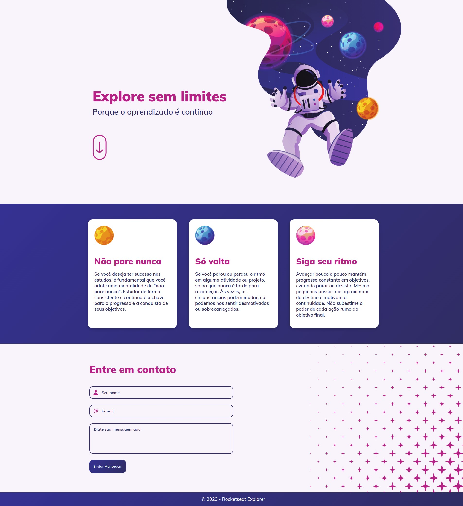

  Desafio realizado dentro do Explorer 
  <a href="https://www.rocketseat.com.br/explorer">Estude esse projeto em formato de vídeo clicando aqui.</a>

  <a href="#-tecnologias">Tecnologias</a>&nbsp;&nbsp;&nbsp;|&nbsp;&nbsp;&nbsp;
  <a href="#memo-licença">Licença</a>

  

 

  

## 🚀 Tecnologias

Esse projeto foi desenvolvido com as seguintes tecnologias:

- HTML e CSS
- Git e Github
- Figma

## 💻 Projeto

Projeto realizado dentro do programa Explorer da Rocketseat. Neste projeto foi abordado conceitos como flexbox, grid, animações, Mobile First, transition, position, uso de variáveis no CSS, acessibilidade, exportação de imagem no Figma, HTML semântico, entre outros.

<a href="https://guidenardideveloper.github.io/explore-sem-limites/?" target="_blank">Clique aqui para visualizar</a>

## :memo: Licença

Esse projeto está sob a licença MIT.

---

Feito com ♥ by Rocketseat :wave: [Participe da nossa comunidade!](https://discord.gg/rocketseat)